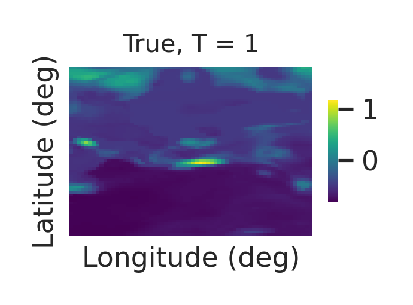
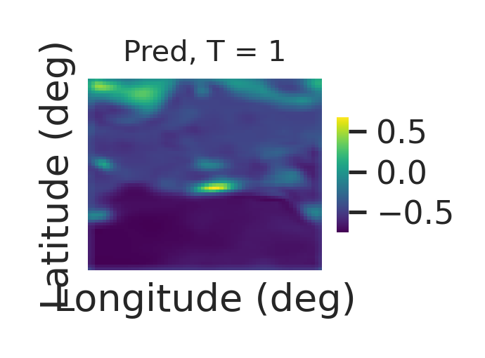

# 🔁 pytorch-convlstm  
A PyTorch-based implementation of **ConvLSTM** for image forecasting tasks.

---

## 📦 Setup Instructions

### 1. Clone the Repository
```bash
git clone https://github.com/pratiknag/pytorch-convlstm.git
cd pytorch-convlstm
````

### 2. Create and Activate a Virtual Environment

Ensure `virtualenv` is installed:

```bash
python3 -m pip install virtualenv
```

Create and activate a virtual environment:

```bash
python3 -m virtualenv env
source env/bin/activate  # For Linux/macOS
```

### 3. Install Dependencies

Install the required packages using:

```bash
pip install -r requirements.txt
```

---

## 🚀 Running the Code

Each script includes a detailed description of its command-line arguments at the top. Here are common usage examples:

### 🔧 Training the Model

Train the ConvLSTM model using:

```bash
python train.py --train --epochs=100
```

> The model is trained on a simulated precipitation dataset (64 × 64 grid), a sample of which is included in the `datasets/` directory.
> For access to the full dataset, please contact **[pratiknag9@gmail.com](mailto:pratiknag9@gmail.com)**.

### 📊 Visualizing Predictions

To generate and visualize predictions:

```bash
python plot.py --t=1
```

---

## 🖼️ Sample Output

Below are example plots of the true and predicted outputs at a specific time step (`t=1`):

|          True Output             |            Predicted Output           |
| :------------------------------: | :-----------------------------------: |
|  |  |

---

## 📝 Citation / Reference

**Spatio-temporal DeepKriging (STDK)** model is used to generate the simulated datasets .
A small simulated dataset is included for demonstration. For scientific use, please cite the corresponding paper [*(Space-Time.DeepKriging)*.](https://www.sciencedirect.com/science/article/abs/pii/S2211675323000489)

---


